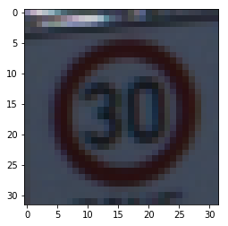
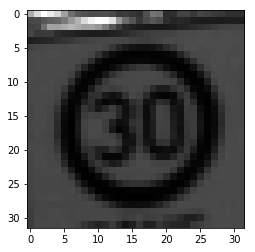
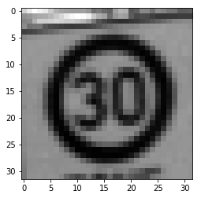

#**Traffic Sign Recognition** 

**Build a Traffic Sign Recognition Project**

The goals / steps of this project are the following:
* Load the data set (see below for links to the project data set)
* Explore, summarize and visualize the data set
* Design, train and test a model architecture
* Use the model to make predictions on new images
* Analyze the softmax probabilities of the new images
* Summarize the results with a written report

[//]: # (Image References)

[image1]: ./processed/1_normal.png "Original"
[image2]: ./processed/2_gray.png "Grayscaling"
[image3]: ./processed/3_adapt.png "Adaptive Histogram Equalization"
[image4]: ./processed/4_flipped.png "Flipped"
[image5]: ./processed/5_rotated.png "Slightly Rotated"
[image6]: ./processed/6_transformed.png "Slightly Transformed"

[image7]: ./TrafficSigns/12_priorityRoad.png "Traffic Sign 4"
[image8]: ./TrafficSigns/14_stop.png "Traffic Sign 5"
[image9]: ./TrafficSigns/17_noEntry.png "Traffic Sign 4"
[image10]: ./TrafficSigns/32_endSpeedlimit.png "Traffic Sign 5"
[image11]: ./TrafficSigns/33_turnRight.png "Traffic Sign 4"

###Rubric Points
###Here I will consider the [rubric points](https://review.udacity.com/#!/rubrics/481/view) individually and describe how I addressed each point in my implementation.  

## Data Set Summary & Exploration

I used the numpy library to calculate summary statistics of the traffic
signs data set:

* The training set consists of 34799 samples.
* The size of the validation set is ??????????????????
* The test set is consists of 12630 samples.
* The shape of a traffic sign image is (32, 32, 3).
* The number of unique classes/labels in the data set is 43.

## Visualisation of the dataset.

Here is an exploratory visualization of the data set. It shows how the images are distributed among the different classes.

  

## Preprocessing

####1. Describe how you preprocessed the image data. What techniques were chosen and why did you choose these techniques? Consider including images showing the output of each preprocessing technique. Pre-processing refers to techniques such as converting to grayscale, normalization, etc. (OPTIONAL: As described in the "Stand Out Suggestions" part of the rubric, if you generated additional data for training, describe why you decided to generate additional data, how you generated the data, and provide example images of the additional data. Then describe the characteristics of the augmented training set like number of images in the set, number of images for each class, etc.)

As a first step, I decided to convert the images to grayscale because I did not see an improvement in accuracy with rgb pictures.

Here is an example of a traffic sign image before and after grayscaling.

 

  

To optimize brightness and contrast I applied Adaptive histogram equalization.

  

The more samples you have available for training the higher is the accuracy, the amount of pictures can in some classes be increased by mirroring the picture.

  

As you can see in the visualisation, the distibution of the samples in the different classes is very different. To increase the accuracy it seems to me you need to have an equal amount of samples for every class. Even after the mirroring some classes have as little as 200 pictures. If we would now just take 200 samples from every class we would ignore a big part of our valuable samples. The logical consequence is to copy the samples in certain classes to multiply the them, to add some variance to every copied picture is slightly rotated.

  

In the program 4000 samples each were used, this means in some classed a sample might have been copied up to 20 times. To further increase the variance I applied some small transformation on a certain percentage.

  

As a last step, I normalized the image data in the range from -1 to 1 as this makes sense mathematically for the statistical calculations of the weights.

##2. Describe what your final model architecture looks like including model type, layers, layer sizes, connectivity, etc.) Consider including a diagram and/or table describing the final model.

## Architecture
My final model consisted of the following layers:

<table>
 <tr>
  <td>Input</td>
  <td>Shape: 32x32x1 Grayscale</td>
 </tr>
 <tr>
  <td style="font-weight: bold;">Convolution 5x5</td>
  <td>Stride:1x1, padding:'VALID', output:28x28x32 </td>
 </tr>
 <tr>
  <td>RELU</td>
  <td></td>
 </tr>
 <tr>
  <td>Max pooling</td>
  <td>strides: 2x2, output: 14x14x32</td>
 </tr>
 <tr>
  <td>Dropout</td>
  <td>keep:70%</td>
 </tr>
 <tr>
  <td style="font-weight: bold;">Convolution 5x5</td>
  <td>Stride:1x1, padding:'VALID', output:10x10x64 </td>
 </tr>
 <tr>
  <td>RELU</td>
  <td></td>
 </tr>
 <tr>
  <td>Dropout</td>
  <td>keep:80%</td>
 </tr>
 <tr>
  <td style="font-weight: bold;">Convolution 5x5</td>
  <td>Stride:1x1, padding:'VALID', output:6x6x128 </td>
 </tr>
 <tr>
  <td>RELU</td>
  <td></td>
 </tr>
 <tr>
  <td>Max pooling</td>
  <td>strides:2x2, output:3x3x128</td>
 </tr>
 <tr>
  <td>Dropout</td>
  <td>keep:70%</td>
 </tr>
 <tr>
  <td style="font-weight: bold;">Fully Connected</td>
  <td>output:1152</td>
 </tr>
 <tr>
  <td style="font-weight: bold;">Fully Connected</td>
  <td>output:350</td>
 </tr>
 <tr>
  <td>RELU</td>
  <td></td>
 </tr>
 <tr>
  <td style="font-weight: bold;">Fully Connected</td>
  <td>output:43</td>
 </tr>
</table>

####3. Describe how you trained your model. The discussion can include the type of optimizer, the batch size, number of epochs and any hyperparameters such as learning rate.

To train the model, I used an ....

####4. Describe the approach taken for finding a solution and getting the validation set accuracy to be at least 0.93. Include in the discussion the results on the training, validation and test sets and where in the code these were calculated. Your approach may have been an iterative process, in which case, outline the steps you took to get to the final solution and why you chose those steps. Perhaps your solution involved an already well known implementation or architecture. In this case, discuss why you think the architecture is suitable for the current problem.

My final model results were:
* training set accuracy of ?
* validation set accuracy of ? 
* test set accuracy of ?

If an iterative approach was chosen:
* What was the first architecture that was tried and why was it chosen?
* What were some problems with the initial architecture?
* How was the architecture adjusted and why was it adjusted? Typical adjustments could include choosing a different model architecture, adding or taking away layers (pooling, dropout, convolution, etc), using an activation function or changing the activation function. One common justification for adjusting an architecture would be due to overfitting or underfitting. A high accuracy on the training set but low accuracy on the validation set indicates over fitting; a low accuracy on both sets indicates under fitting.
* Which parameters were tuned? How were they adjusted and why?
* What are some of the important design choices and why were they chosen? For example, why might a convolution layer work well with this problem? How might a dropout layer help with creating a successful model?

If a well known architecture was chosen:
* What architecture was chosen?
* Why did you believe it would be relevant to the traffic sign application?
* How does the final model's accuracy on the training, validation and test set provide evidence that the model is working well?
 

###Test a Model on New Images

####1. Choose five German traffic signs found on the web and provide them in the report. For each image, discuss what quality or qualities might be difficult to classify.

Here are five German traffic signs that I found on the web:

![alt text][image4] ![alt text][image5] ![alt text][image6] 
![alt text][image7] ![alt text][image8]

The first image might be difficult to classify because ...

####2. Discuss the model's predictions on these new traffic signs and compare the results to predicting on the test set. At a minimum, discuss what the predictions were, the accuracy on these new predictions, and compare the accuracy to the accuracy on the test set (OPTIONAL: Discuss the results in more detail as described in the "Stand Out Suggestions" part of the rubric).

Here are the results of the prediction:

| Image			        |     Prediction	        					| 
|:---------------------:|:---------------------------------------------:| 
| Stop Sign      		| Stop sign   									| 
| U-turn     			| U-turn 										|
| Yield					| Yield											|
| 100 km/h	      		| Bumpy Road					 				|
| Slippery Road			| Slippery Road      							|

The model was able to correctly guess 4 of the 5 traffic signs, which gives an accuracy of 80%. This compares favorably to the accuracy on the test set of ...

####3. Describe how certain the model is when predicting on each of the five new images by looking at the softmax probabilities for each prediction. Provide the top 5 softmax probabilities for each image along with the sign type of each probability. (OPTIONAL: as described in the "Stand Out Suggestions" part of the rubric, visualizations can also be provided such as bar charts)

The code for making predictions on my final model is located in the 11th cell of the Ipython notebook.

For the first image, the model is relatively sure that this is a stop sign (probability of 0.6), and the image does contain a stop sign. The top five soft max probabilities were

| Probability         	|     Prediction	        					| 
|:---------------------:|:---------------------------------------------:| 
| .60         			| Stop sign   									| 
| .20     				| U-turn 										|
| .05					| Yield											|
| .04	      			| Bumpy Road					 				|
| .01				    | Slippery Road      							|

For the second image ... 

### (Optional) Visualizing the Neural Network (See Step 4 of the Ipython notebook for more details)
####1. Discuss the visual output of your trained network's feature maps. What characteristics did the neural network use to make classifications?

